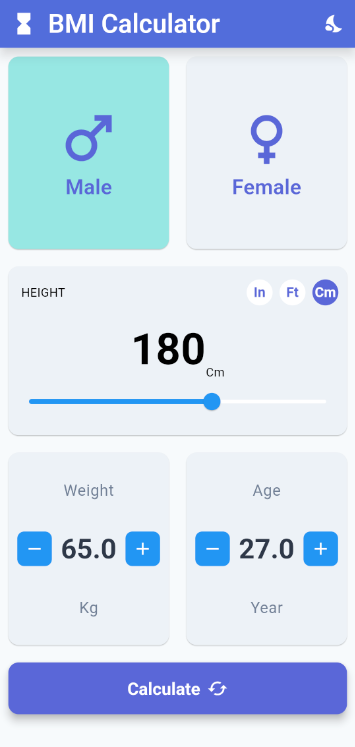
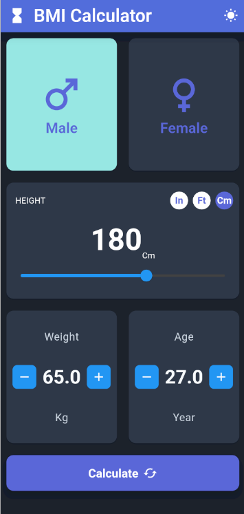
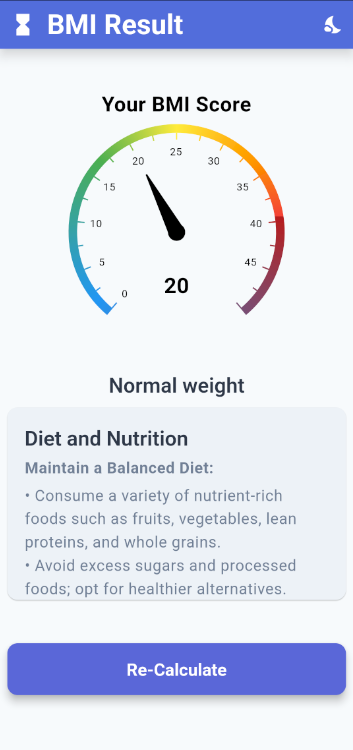
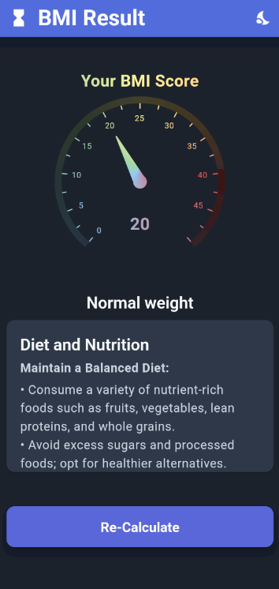

# BMI Calculator

BMI Calculator is a simple and intuitive Flutter-based app that helps users easily calculate their Body Mass Index (BMI) and determine their weight category based on the calculated BMI. Additionally, the app offers health advice, including diet, exercise, and lifestyle tips based on your BMI category.

## Table of Contents

- [Features](#features)
- [Screenshots](#screenshots)
- [Installation](#installation)
- [Usage](#usage)
- [BMI Categories](#bmi-categories)
- [Contributing](#contributing)
- [License](#license)
- [Contact](#contact)

---

## Features

- **User Input**: Simple and intuitive interface for entering your height, weight, age, and gender.
- **Multiple Unit Support**: Allows users to switch between height measurements in feet, inches, or centimeters.
- **BMI Calculation**: Automatically calculates your BMI and displays your result instantly.
- **Health Advice**: Provides relevant health advice based on your BMI category, including diet and exercise recommendations.
- **Dark/Light Theme Support**: Toggle between light and dark themes for a comfortable user experience.
- **Gender-Specific Advice**: Personalized feedback and suggestions based on your gender.

---

## Screenshots

| Light Theme | Dark Theme |
|-------------|------------|
|   |  |
|   |  |

---

## Installation

### Prerequisites

Before you begin, ensure you have the following installed on your machine:

- [Flutter SDK](https://flutter.dev/docs/get-started/install)
- Dart SDK
- Android Studio or VS Code (with the Flutter plugin)
- A physical device or emulator for testing the app

### Steps to Install

1. **Clone the Repository**:
   Open your terminal or command prompt, and clone the repository using Git:
   ```bash
   git clone https://github.com/MAITH98/bmi_calculator.git
   ```

2. **Navigate to the Project Directory**:
   ```bash
   cd bmi_calculator
   ```

3. **Install the Dependencies**:
   Run the following command to fetch the required Flutter dependencies:
   ```bash
   flutter pub get
   ```

4. **Run the App**:
   Launch the app on your device/emulator with:
   ```bash
   flutter run
   ```

---

## Usage

1. **Open the App**: Once launched, you’ll see the input screen where you can enter your weight, height, age, and gender.
   
2. **Input Your Data**: Select your measurement units and input your information. Toggle between male and female if necessary.
   
3. **Calculate BMI**: Click the **Calculate** button to instantly compute your BMI and view your results.
   
4. **View Results & Advice**: Based on your BMI category, you will receive tailored health, diet, and exercise advice directly in the app.

---

## BMI Categories

| Category       | BMI Range        | Description                                   |
|----------------|------------------|-----------------------------------------------|
| Underweight    | Less than 18.5    | Your BMI indicates that you are underweight.  |
| Normal Weight  | 18.5 to 24.9      | You have a normal BMI.                        |
| Overweight     | 25.0 to 29.9      | Your BMI indicates that you are overweight.   |
| Obesity        | 30.0 and above    | You fall into the obese category.             |

For each BMI range, the app provides specific health advice to help improve or maintain your health.

---

## Contributing

We welcome contributions from the community! If you’d like to contribute to the project, follow these steps:

1. **Fork the Repository**: Click the Fork button on the top right of the repository page.
2. **Create a Feature Branch**:
   ```bash
   git checkout -b feature/your-feature
   ```
3. **Commit Your Changes**:
   ```bash
   git commit -m "Add your feature"
   ```
4. **Push to the Branch**:
   ```bash
   git push origin feature/your-feature
   ```
5. **Open a Pull Request**: Once you push the changes, open a Pull Request (PR) on the GitHub repository.

For more details, refer to the [Contribution Guidelines](CONTRIBUTING.md).

---

## License

This project is licensed under the MIT License. See the [LICENSE](LICENSE) file for more details.

---

## Contact

For any questions or feedback, feel free to reach out:

- **Email**: [m.h.alamri@outlook.com](mailto:m.h.alamri@outlook.com)
- **GitHub**: [@MAITH98](https://github.com/MAITH98)

Thank you for using the BMI Calculator app!